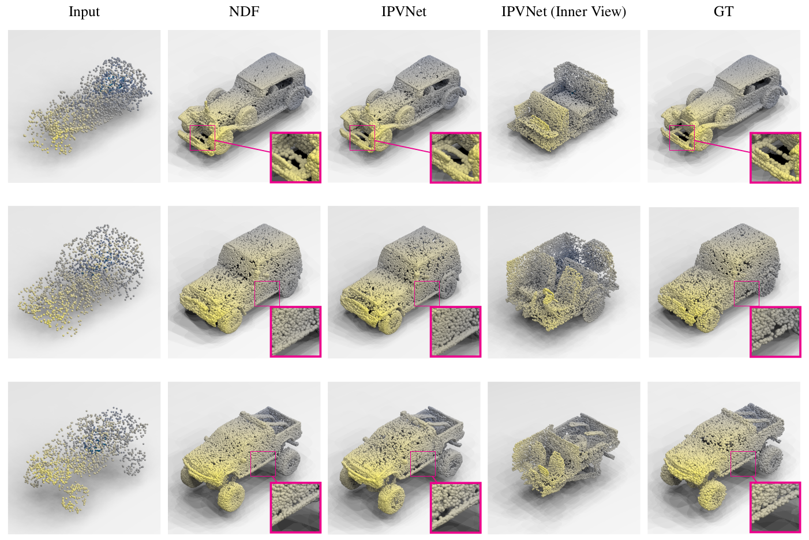
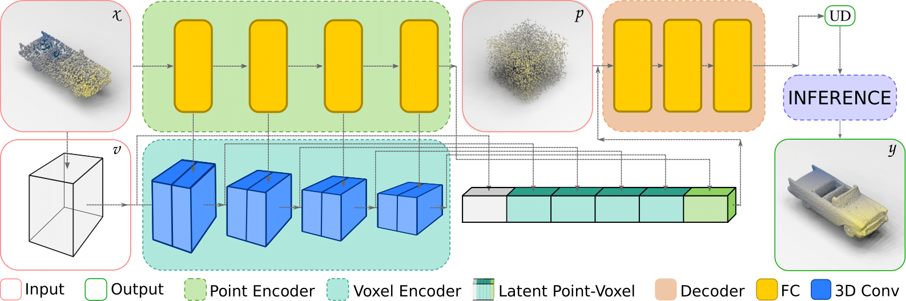

## IPVNet: Learning Implicit Point-Voxel Features for Open-Surface 3D Reconstruction

### Overview

Reconstruction of 3D open surfaces (e.g., non-watertight meshes) is an
underexplored area of computer vision. Learning-based implicit techniques
enable reconstruction in arbitrary resolutions. Yet, these approaches rely on
distinguishing between the inside and outside of a surface in order to extract
a zero level set when reconstructing the target. In the case of open surfaces,
this distinction often leads to artifacts such as the artificial closing of
surface gaps.

<p align="center">
  
</p>

This repository provides source code for our 2023 Journal of Visual
Communication and Image Representation article titled "[IPVNet: Learning
Implicit Point-Voxel Features for Open-Surface 3D Reconstruction
](https://arxiv.org/pdf/2311.02552.pdf)." IPVNet is a learning-based implicit
point-voxel model that facilitates the accurate reconstruction of open surfaces
without introducing outliers. Our model predicts the unsigned distance between
a surface and a query point in 3D space by leveraging both raw point cloud data
and its discretized voxel counterpart. 

### Citation

If you find this project useful, then please consider citing our work.

```bibitex
@article{arshad2023ipvnet,
  title={IPVNet: Learning Implicit Point-Voxel Features for Open-Surface 3D Reconstruction},
  author={Mohammad Samiul Arshad and William J. Beksi},
  journal={Journal of Visual Communication and Image Representation},
  pages={103970},
  year={2023},
  issn={1047-3203},
  doi={https://doi.org/10.1016/j.jvcir.2023.103970},
  url={https://www.sciencedirect.com/science/article/pii/S1047320323002201},
}
```

### Model Architecture

<p align="center">
  
</p>

### Installation

First, clone and navigate to the project in your terminal

    $ git clone https://github.com/robotic-vision-lab/Implicit-Point-Voxel-Features-Network.git
    $ cd Implicit-Point-Voxel-Features-Network

The `environment.yml` file contains all of the necessary dependencies for the
project. To create a conda environment, execute the following commands

    $ conda env create -f environment.yml
    $ conda activate IPVNet

### Data Processing

We make use of the data processing scripts provided by the authors of
[NDF](http://virtualhumans.mpi-inf.mpg.de/ndf/) to prepare the data for our
experiments. Please follow the [directions](https://github.com/jchibane/ndf) for
downloading and processing the data.

To prepare IPVNet for training, first create a configuration file in the folder
`configs` (e.g., use `configs/shapenet_raw.txt` as a reference). Then, generate
a random training/validation/test split of the data using the following command

    $ python dataprocessing/create_split.py --config configs/EXP_NAME.txt

You can replace `configs/EXP_NAME.txt` in the above command with the desired
configuration.

## Usage 

### Model Training 

IPVNet can be trained by invoking the command 

    $ python train.py --config configs/EXP_NAME.txt

### Model Inference

To generate results for instances of the test set, run the command 

    $ python generate.py --config configs/EXP_NAME.txt

The file `configs/EXP_NAME.txt` in the above command can be replaced with the
desired configuration.

### License

[](https://github.com/robotic-vision-lab/Implicit-Point-Voxel-Features-Network/blob/main/LICENSE)
